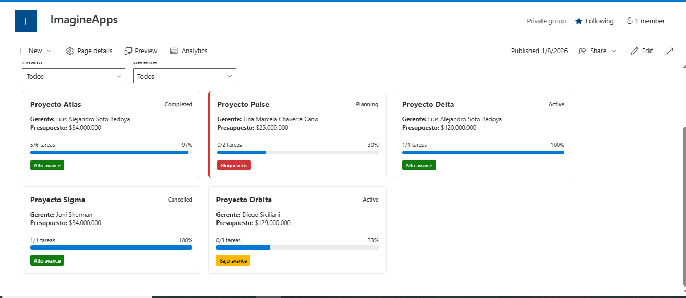

## 📄 Prueba Técnica – ImagineApps

Adjunto mi prueba técnica correspondiente al desarrollo del WebPart en SharePoint.

### 📦 Repositorio de Código Fuente
- GitHub:  
  https://github.com/luissotobedoya/imagineApps

### 🌐 Sitio de SharePoint (Despliegue)
- WebPart desplegado en:  
  https://s0660.sharepoint.com/sites/ImagineApps

### 🖼️ Evidencia Visual

### 📋 Listas de SharePoint

- **Lista de Proyectos**  
  https://s0660.sharepoint.com/sites/ImagineApps/Lists/Proyectos/AllItems.aspx

- **Lista de Tareas**  
  https://s0660.sharepoint.com/sites/ImagineApps/Lists/Tareas/AllItems.aspx

### 🔄 Flujos de Power Automate

- **Asignación de código de proyecto**  
  https://make.powerautomate.com/environments/Default-b9a91340-a914-4bdb-a00b-1df98c9a06e6/flows/44664b21-a701-ac2b-3535-79b90ac7ef39/details

- **Gestión Inteligente de Tareas**  
  https://make.powerautomate.com/environments/Default-b9a91340-a914-4bdb-a00b-1df98c9a06e6/flows/e72925ec-413a-f5d1-6ca4-5adce26bb09f/details

### 🔐 Credenciales de Acceso (Solo para Evaluación)

> ⚠️ **Las credenciales no se exponen en el repositorio público.**  
> Serán compartidas de forma privada con el evaluador si es necesario.

- Usuario: `adminbot@s0660.onmicrosoft.com`
- Contraseña: *(compartida por canal privado)*
